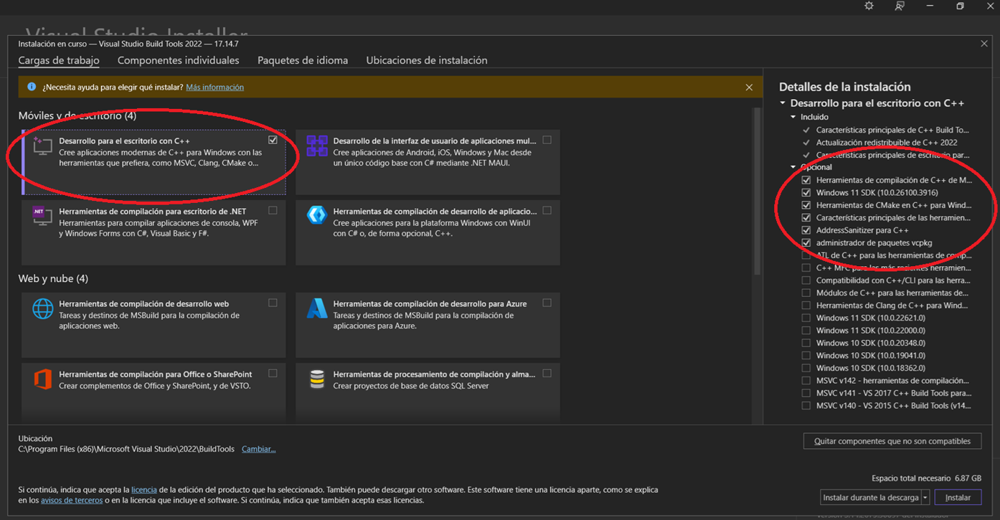

# Instalación y ejecución de Electric Eye

Este documento describe los pasos necesarios para instalar, configurar y ejecutar el sistema Electric Eye, incluyendo dependencias esenciales, herramientas externas, configuración del entorno virtual en Windows, y procedimientos de ejecución de los componentes del sistema.

Para una descripción general del proyecto, consulta [README.md](README.md). Para contribuir, consulta [CONTRIBUTING.md](CONTRIBUTING.md).

---

## Requisitos Previos

Antes de iniciar, asegúrese de contar con lo siguiente:

- **Sistema operativo:** Windows 10/11 64 bits
- **Conexión a internet estable**
- **Permisos de administrador**

---

## Paso 1: Instalación de Dependencias

A continuación se detallan las herramientas necesarias y sus enlaces de descarga:

### 1.1. Python 3.10.11

- **Descarga oficial:** https://www.python.org/downloads/release/python-31011/
- **Descarga directa:** [[Python 3.10.11](https://www.python.org/ftp/python/3.10.11/python-3.10.11-amd64.exe)]

**Importante:** Durante la instalación, asegúrese de marcar la opción: **"Add Python to PATH"**

### 1.2. CMake 3.31.8

- **Descarga oficial:** https://cmake.org/download
- **Descarga directa:** [[CMake 3.31.8](https://github.com/Kitware/CMake/releases/download/v3.31.8/cmake-3.31.8-windows-x86_64.msi)]

**Importante:** Durante la instalación, seleccione: **"Add CMake to the system PATH for all users"**

### 1.3. Microsoft Visual Studio Build Tools

- **Descarga oficial:** https://visualstudio.microsoft.com/es/visual-cpp-build-tools/
- **Descarga directa:** [[Microsoft Visual Studio Build Tools](https://download.visualstudio.microsoft.com/download/pr/13907dbe-8bb3-4cfe-b0ae-147e70f8b2f3/a3193e6e6135ef7f598d6a9e429b010d77260dba33dddbee343a47494b5335a3/vs_BuildTools.exe)]

**Importante:** Durante la instalación, seleccione: **"Desarrollo para escritorio con C++"**  
Además, marque todas las herramientas adicionales sugeridas en la sección derecha del instalador.



### 1.4. Node.js 22.22.3 LTS

#### Opción A: Instalación Directa (Si no tienes Node.js instalado)

- **Descarga oficial:** https://nodejs.org/en/download/
- **Descarga directa:** [Node.js 22.22.3](https://nodejs.org/dist/v22.22.3/node-v22.22.3-x64.msi)

Durante la instalación, asegúrese de que todas las opciones estén marcadas, incluyendo npm package manager.

#### Opción B: Usando NVM (Node Version Manager) - Recomendado si ya tienes Node.js

Si ya tienes otra versión de Node.js instalada, se recomienda usar **NVM para Windows** para gestionar múltiples versiones:

1. **Descargar NVM para Windows:**
   - Repositorio oficial: https://github.com/coreybutler/nvm-windows/releases
   - Descarga: [última versión estable](https://github.com/coreybutler/nvm-windows/releases/latest)

2. **Instalar Node.js 22.22.3 con NVM:**
   ```bash
   # Instalar Node.js 22.22.3
   nvm install 22.22.3
   
   # Usar Node.js 22.22.3
   nvm use 22.22.3
   
   # Verificar la versión activa
   node -v
   ```

3. **Verificar que npm esté instalado:**
   ```bash
   npm -v
   # Debería mostrar: 10.9.8 (o una versión compatible posterior)
   ```

### 1.5. Angular CLI 21.2

El proyecto incluye Angular CLI como dependencia local. No es necesario instalar ni actualizar una CLI global; `npm ci` instala la versión registrada en `package-lock.json`.

#### Verificar la versión local

```bash
npx ng version
```

#### Verificar versiones instaladas

```bash
node -v      # Debe mostrar: v22.22.3
npm -v       # Debe mostrar: 10.9.8 o compatible
npx ng version  # Debe mostrar Angular CLI 21.2.x y Angular 21.2.x
```

**Ejemplo de resultado esperado de `ng version`:**

```
Angular CLI       : 21.2.x
Angular           : 21.2.x
Node.js           : 22.22.3
Package Manager   : npm 10.9.x
```

---

## Paso 2: Configuración del Entorno de Desarrollo en Python

### 2.1 Crear entorno virtual

```bash
python -m venv .venv
```

### 2.2 Activar entorno virtual

```bash
.venv\Scripts\Activate
```

---

## Paso 3: Instalación de Librerías Necesarias

Instala las dependencias declaradas por el proyecto:

```bash
python -m pip install --upgrade pip
```

```bash
pip install -r requirements.txt
```

### Desactivar entorno virtual

Al finalizar el trabajo, puedes cerrar el entorno virtual con:

```bash
deactivate
```

---

## Paso 4: Configuración segura

La configuración privada se carga desde un archivo `.env` local. Este archivo está excluido por `.gitignore` y **nunca debe confirmarse ni enviarse al repositorio**.

1. Crea tu archivo local a partir de la plantilla:

```powershell
Copy-Item .env.example .env
```

2. Genera valores aleatorios distintos para `JWT_SECRET` y `AI_INGEST_KEY`. Puedes ejecutar este bloque dos veces y copiar cada resultado en la variable correspondiente:

```powershell
$bytes = New-Object byte[] 48
[Security.Cryptography.RandomNumberGenerator]::Fill($bytes)
[Convert]::ToBase64String($bytes)
```

3. Edita `.env` y configura, como mínimo, `MONGO_URI`, `JWT_SECRET` y `AI_INGEST_KEY`. Configura también `CAMERA_RTSP_URL` si utilizarás snapshots de una cámara IP. Si una URI incluye usuario y contraseña, esos datos deben existir únicamente en `.env` o en el gestor de secretos del entorno de despliegue.

`FRONTEND_ORIGINS` contiene la lista separada por comas de orígenes autorizados por CORS. `HOST` queda en `127.0.0.1` para desarrollo local; en un contenedor puede establecerse explícitamente en `0.0.0.0` y protegerse mediante firewall y proxy inverso.

La plantilla [`.env.example`](.env.example) solo contiene ejemplos y marcadores sin credenciales reales. Para producción se debe usar el gestor de secretos de la plataforma; no se debe copiar el `.env` local al servidor ni incorporarlo a una imagen de contenedor.

---

## Paso 5: Ejecución del Sistema

### 5.1. Ejecución del BACKEND

1. Navega a la carpeta `/backend`
2. Ejecuta el comando para instalar dependencias:

```bash
npm ci
```

3. Inicia el backend con:

```bash
npm start
```

4. Comprueba su estado:

```powershell
Invoke-RestMethod http://localhost:3000/health
```

El resultado esperado es `status: ok` y `database: true`.

### 5.2. Ejecución del FRONTEND

1. Navega a la carpeta `/frontend`
2. Ejecuta el comando para instalar dependencias:

```bash
npm ci
```

3. Inicia el frontend con la CLI local:

```bash
npm start
```

**Nota:** Las funcionalidades del frontend dependen de que el backend esté en ejecución.

4. Antes de proponer cambios, valida el frontend:

```bash
npm run build
npm test -- --watch=false --browsers=ChromeHeadless --reporters=progress
```

5. Valida también el backend:

```bash
cd backend
npm test
npm audit --omit=dev
```

### 5.3. Ejecución de la IA

Ejecuta el archivo `Main.py` de la manera que prefieras.

**Recomendación:** Hazlo desde una terminal ejecutando:

```bash
python Main.py
```

#### Para detener la IA:

- Pulsa la letra **`q`** en la ventana emergente, O
- Presiona **`Ctrl+C`** en la terminal
- **Importante:** En algunas terminales NO basta con hacer `Ctrl+C`. En ese caso, abre el **Administrador de tareas** de Windows y finaliza la tarea **Python** manualmente.

---

## Notas Importantes

### Lógica de Negocio - Clave de Activación

Después del registro, el usuario debe solicitar una **clave de activación de un solo uso** al operador del sistema. El frontend nunca crea ni muestra claves automáticamente.

El operador genera una clave desde un entorno con acceso autorizado a MongoDB:

```bash
cd backend
npm run create-activation-key
```

La clave se muestra una sola vez en la terminal. Debe enviarse al usuario por un canal privado y no debe guardarse en Git, documentación o capturas públicas. La API también permite crear claves mediante `POST /api/usuarios/claves-activacion`, pero exige una sesión con rol `admin`.

Para convertir una cuenta ya registrada en la primera cuenta administradora, el operador puede ejecutar localmente:

```bash
cd backend
npm run promote-admin -- administrador@ejemplo.com
```

No existe registro público de administradores ni selección de rol desde el cliente.

### Seguridad de integraciones

- `Main.py` debe enviar `AI_INGEST_KEY` en la cabecera `X-Ingest-Key` para registrar detecciones.
- Los snapshots requieren una sesión activa y usan `CAMERA_RTSP_URL`; no hay credenciales de cámara en el código.
- Las fotografías biométricas se entregan mediante enlaces firmados que expiran en cinco minutos.
- Login, 2FA, registro y activación tienen límites de solicitudes.
- La creación de usuarios administrados y claves requiere rol de administrador.
- Los secretos reales pertenecen únicamente a `.env` o al gestor de secretos del despliegue.

### Autenticación de Dos Factores (2FA)

La autenticación TOTP no necesita conexión continua a internet, pero el reloj del servidor y del teléfono debe estar correctamente sincronizado.

### Configuración del Dataset para Entrenamiento

Se requiere ajustar la ruta del archivo `data.yaml` para nuevos entrenamientos, específicamente la línea:

```yaml
path: C:\...\dataset
```

### Reconocimiento Facial - Archivo `reference_encodings.pkl`

Se necesita un archivo `reference_encodings.pkl` para poder ejecutar el reconocimiento facial. Este archivo **NO se incluye** ya que contiene matrices faciales personales únicas.

#### Para generar tu archivo `reference_encodings.pkl`:

1. Abre el archivo `.env`
2. Configura la variable con la ruta de la carpeta de fotografías:

```dotenv
REFERENCE_DIRECTORY=C:\Users\usuario\ElectricEye\fotos
```

3. Dentro de la carpeta `/fotos` hay 3 subcarpetas de ejemplos
4. Dentro de cada subcarpeta debes colocar **al menos 10 fotos** de cada persona para obtener sus datos faciales
5. Se recomienda que sean fotos con:
   - Diferentes ángulos
   - Diferentes gestos
   - Diferentes condiciones de iluminación
   - Variaciones generales

#### Lógica de Generación del Archivo `reference_encodings.pkl`

**MUY IMPORTANTE:**

- Si ya has ejecutado `Main.py` y se generó el archivo `reference_encodings.pkl`, la siguiente vez que ejecutes `Main.py` **NO se generará el archivo de nuevo**.
- Para generar uno nuevo, debes **borrar** el archivo `reference_encodings.pkl` existente.
- El sistema **NO escanea siempre** la carpeta `/fotos` en busca de subcarpetas nuevas o fotos nuevas en subcarpetas existentes.

### Modelo de YOLO

El archivo `entrenamiento.pt` es el **modelo final de YOLO** que se entrega. Si se requiere hacer un modelo más preciso, se ha dejado el archivo `dataset.rar` para hacer nuevos entrenamientos personalizados.

**Nota:** `dataset.rar` contiene el dataset completo. Por la naturaleza del tamaño de esta carpeta, ha sido comprimida.

---

## Recomendaciones Adicionales

- Se recomienda trabajar dentro del entorno virtual para evitar conflictos de versiones.
- Mantén todos los componentes del sistema actualizados según las versiones especificadas.
- Asegúrate de contar con suficiente espacio en disco para el dataset y los modelos entrenados.

---

## Contribuir

La rama `main` está protegida. Todo cambio debe enviarse mediante una rama independiente y un Pull Request.

Consulta la guía completa en [CONTRIBUTING.md](CONTRIBUTING.md).

---

## Licencia

Electric Eye se distribuye bajo la [GNU Affero General Public License v3.0 únicamente](LICENSE) (`AGPL-3.0-only`). Las versiones modificadas que se distribuyan deben conservar los avisos y ofrecer su código fuente bajo la misma licencia. Si una versión modificada se ejecuta como servicio accesible por red, sus usuarios también deben poder obtener el código fuente correspondiente.

Copyright © 2026 Paleta911.
